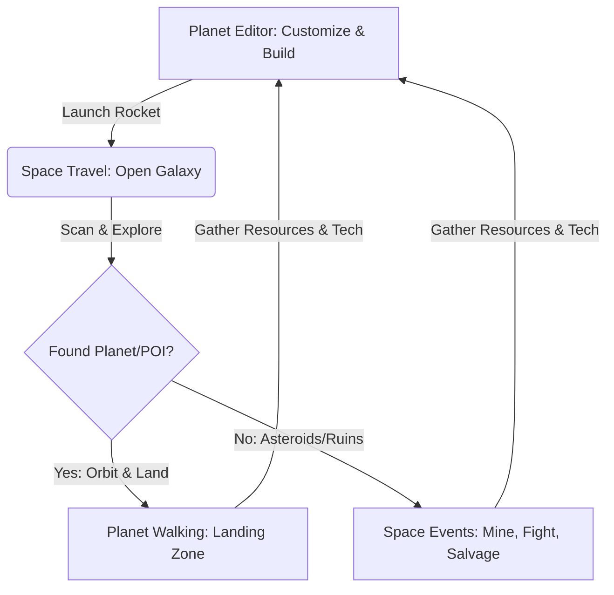

# Starforge Planets: Brainstorming & Concepts

This document compiles brainstormed ideas, mechanics, and design concepts for the core pillars of **Starforge Planets**: Planetary Mechanics, Space Travel, and Planet Walking.

---

## 🚀 Core Gameplay Loop

---

## 🪐 Pillar 1: Planetary Mechanics

Planetary mechanics define how planets behave, how they are generated, and how their environment affects gameplay on the surface and in orbit.

### 1. Dynamic Gravity Fields
*   **Low Gravity (e.g., Ice/Moon worlds):** Floaty jump physics, higher jumps, slower falling. Rockets use less fuel to escape orbit.
*   **High Gravity (e.g., Heavy Metal/Lava worlds):** Heavy jumps, faster fall rates, falling damage risks. Rockets require upgraded engines or more thruster fuel to lift off.
*   **Zero Gravity (e.g., Asteroids, Space Stations):** Full 3D thruster movement (EVA suit) for the player.

### 2. Atmospheric & Weather Hazards
*   **Acid Rain / Solar Wind:** Slowly drains ship/suit shields. Players must build protective outposts or upgrade their suit’s hazard shield.
*   **Electric Storms:** Scrambles the ship’s radar/minimap and disables advanced building tools temporarily. Lightning strikes spawn charged crystals.
*   **Meteor Showers:** Dynamic environmental events where players can dodge falling debris or mine freshly landed meteorites containing rare elements (e.g., Stardust).

### 3. Planetary Rotation & Time of Day
*   Synchronized day/night cycles on the surface that match the planet's rotation when viewed from space.
*   **Daytime:** High solar energy (boosts resource mines), friendly NPCs out and about.
*   **Nighttime:** Glowing flora/fauna emerge (useful for gathering Plasma/Crystals), shadow creatures or pirates raid outposts.

---

## 🌌 Pillar 2: Open-World Space Travel

Space travel connects the player's home planet to the rest of the galaxy. It should feel exploratory, vast, and visually striking.

### 1. Seamless Orbital Transition
*   Instead of a boring loading screen, players fly their rocket down from orbit:
    1.  **High Orbit:** Planet is a 3D sphere. Custom features (rings, oceans, cities) are visible.
    2.  **Atmospheric Entry:** The screen shakes, friction sparks/shield-burn effects wrap around the ship, and clouds rush past.
    3.  **Low Orbit / Landing:** The camera transition smoothly angles behind the ship as it glides toward the landing zone.

### 2. Navigation & Exploration Features
*   **The Quantum Compass:** A radar system on the dashboard showing signals:
    *   *Green signals:* Friendly space stations or trade fleets.
    *   *Blue signals:* Resource anomalies (asteroid clusters, comets).
    *   *Purple signals:* Ancient alien ruins or mystery warp gates.
    *   *Red signals:* Pirate sectors or combat zones.
*   **Interactive Cockpit HUD:** In first-person or close third-person view, players can click cockpit buttons or use their scanner overlay to identify resources on passing asteroids.

---

## 🚶 Pillar 3: Planet Walking & Surface Gameplay

Planet walking represents the ground-level sandbox experience when players leave their ships.

### 1. The Survival / Exploration Tool (The "Multi-Tool")
A versatile device carried by the player that handles all ground tasks:
*   **Mining Laser:** Carves out crystals, metals, and plasma.
*   **Terrain Manipulator:** Small-scale terrain sculpting (flattening areas for building, digging tunnels to reach underground caves).
*   **Discovery Scanner:** Scans local plants, creatures, and ruins to register them in the Galactic Codex, rewarding the player with Stardust.

### 2. Outpost Building & Customization
*   Players place structural modules:
    *   *Glass domes* for viewing the alien sky.
    *   *Solar panel arrays* or *Wind turbines* for power.
    *   *Automated extractors* to slowly mine local materials while away.
    *   *Launchpads* to summon their rocket to different parts of the planet.

### 3. Traversal Gadgets
*   **Hover-board:** Fast gliding across flat surfaces, oceans, or lava (requires fire-proofing).
*   **Grappling Hook:** Quick traversal up cliffs, mountains, and giant alien trees.
*   **Jetpack:** A short-burst jetpack to cross wide chasms or scale tall ruins.

---

## 🎮 The Right-Side Controller Layout (Ground vs. Space)

The four right-side shape buttons change functionality depending on context:

| Button | 🚀 In Space / Flight Mode | 🚶 On Foot / Walk Mode |
| :--- | :--- | :--- |
| **X** | **Chat/Comms:** Toggle communication overlay. | **Chat/Emote:** Open chat or trigger character animations. |
| **Triangle** | **Cargo/Cargo hold:** Inspect collected resources & fuel. | **Inventory/Weapons:** View gear, minerals, and change tools. |
| **Circle** | **Hyperdrive / Engine Boost:** Dynamic speed burst. | **Jetpack / Jump:** Jump or boost upwards in the air. |
| **Square** | **System Scanner:** Map nearby space coordinates. | **Outpost Builder:** Open construction wheel to place structures. |

---

## 💡 Creative Brainstorming Prompts for Discussion

To help shape the gameplay, here are some open questions:
1.  **The "Home" Planet:** Does the player start on a barren rock and slowly transform it, or do they choose a starter biome (e.g., grassy forest vs. frozen tundra)?
2.  **Resource Harvesting:** Should mining be manual, or should the focus be on building auto-harvesters so the player can spend more time exploring?
3.  **NPC Interactions:** Should the galaxy contain friendly alien races (e.g., cute space traders, robot helpers) that live in cities and offer quests?
4.  **Rocket Customization Effect:** Should the size/shape of the built rocket affect how it flies (heavy ships turn slower but have more cargo/shields) or should it be purely cosmetic?
