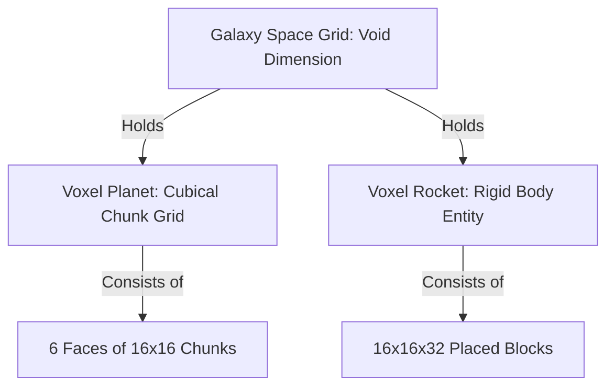

# Voxel Space Game: Layout & Design Specs (Java / Minecraft Style)

This document establishes the user interface, system architecture, and layout for a Java-based, voxel-style space adventure. The visual design, HUD, and grid systems are designed to feel like Minecraft.

---

## 🖥 1. HUD (Heads-Up Display) Layout

When playing, the screen should have a clean, retro pixel-art HUD layout:

```
+-----------------------------------------------------------+
| [System: Orbiting Astra-9]                       120 FPS  |
|                                                           |
|                                                           |
|                             +                             |
|                         (Crosshair)                       |
|                                                           |
|                                                           |
|    [Oxygen: ============]          [Shields: ============] |
|    [  HP  : 💛💛💛💛💛💛💛💛💛💛]   [Energy : ⚡⚡⚡⚡⚡⚡⚡⚡⚡⚡] |
|    +--+--+--+--+--+--+--+--+--+                           |
|    |1 |2 |3 |4 |5 |6 |7 |8 |9 | [Off-hand: Tool]          |
|    +--+--+--+--+--+--+--+--+--+                           |
+-----------------------------------------------------------+
```

### HUD Components
*   **Voxel Hotbar (9 slots)**: Bottom center. Holds block types, weapons, scanner tools, and resources.
*   **Off-hand slot**: Displays active tool (e.g. Star-scanner or Gravity tether).
*   **Vitals HUD**:
    *   *Left side:* Health hearts (💛) and Oxygen meter (critical for planet walking without atmosphere).
    *   *Right side:* Energy bars (⚡) and Ship/Suit shield status.
*   **Color-Coded Coordinate Dashboard**: Top-left corner. Displays the unified 3D coordinate values:
    *   <span style="color:#ff3333; font-weight:bold;">X-Axis (Red)</span>: East/West position.
    *   <span style="color:#33ff33; font-weight:bold;">Y-Axis (Green)</span>: Altitude / Elevation.
    *   <span style="color:#3333ff; font-weight:bold;">Z-Axis (Blue)</span>: North/South position.
    This color-coded layout makes navigating deep space sectors and planets intuitive.

---

## 🗂 2. Game Menu Layouts

These are the primary full-screen UI layouts for customization and navigation, designed using retro voxel blocks.

### Layout A: Planet Creator (Voxel Editor)
Instead of smooth sliders, players design their planet block-by-block or generate biomes using standard block types.
*   **Left Sidebar (Materials Palette)**: A grid of voxel types (e.g. Grass Block, Ice Block, Basalt, Magma, Glow-Crystal, Solar-Dust block).
*   **Center Viewport**: A 3D preview of a mini voxel planet (represented as a 3D block sphere).
*   **Right Sidebar (Tools)**:
    *   *Brush size:* 1x1x1, 3x3x3, or 5x5x5 brush.
    *   *Symmetry tools:* Mirror drawing (axial symmetry for rings/craters).
    *   *Generation seed input:* Text bar to procedurally generate a starter planet (e.g., Grassy, Cryo, Magmatic).

### Layout B: Rocket Constructor (Assembly Grid)
Rockets are built out of standard cubic voxel blocks, allowing players to build custom ship shapes block-by-block.
*   **Cosmetic Freedom**: Players can construct the hull out of any standard blocks (wool, iron, wood, glass) to ensure total artistic freedom. Every built rocket will fly regardless of design.
*   **Functional Customization**: Adding specialized block modules directly influences ship statistics:
    *   *Thruster Blocks:* Placed on the rear; increases propulsion speed.
    *   *Fuel Tank Blocks:* Stored internally; increases jump range.
    *   *Reactor Blocks:* Powers active shields and scanner tools.
    *   *Cargo Chest Blocks:* Extends cargo slots.

---

## 🏔 3. Planetary & Space Grid Architecture (Java Voxel Systems)

To achieve the Minecraft look-and-feel in Java, the world layout uses block coordinates and chunk grids.



### 1. Flat Cubical Gravity Layout
*   **Cubical Structure**: Planets are structured as giant voxel cubes rather than spheres, keeping block grid alignment perfect.
*   **Dynamic Face-Gravity Vector**: The gravity vector pulls straight down relative to the planet face the player is currently standing on.
*   **Edge Traversals (Camera Portals)**: You can walk directly to the edge of the flat face. As you cross the edge boundary, the camera acts like a portal lens—warping coordinates seamlessly to make the adjacent face unfold and appear completely flat under your feet.

### 2. Space Flight Dimension
*   Space is a void dimension.
*   Rockets are represented as moving voxel entities (a grouped collection of blocks).
*   **Damage & Destruction**: Crashing into voxel asteroids or hostile lasers can completely blow your ship up, breaking blocks apart dynamically.
*   **Cloning Reconstitution Loop (Borderlands-Style)**: To prevent punishing players, death and ship destruction are handled by advanced cloning tech. If your ship explodes, a reconstruction beam recreates your cloned body and customized spacecraft template at the nearest planetary spaceport or orbital hangar instantly.

### 3. Unified 3D Coordinate Grid
*   Both space flight and ground coordinates use a single, unified 3D vector map. Instead of switching coordinate systems between space and planet faces, a global $X, Y, Z$ grid translates seamlessly.

---

## 🪐 4. Space-to-Ground Transition ("Origami Warp" Layout)

To make orbital entry visually spectacular without overloading the Java engine:
1.  **High Orbit (Cube View)**: From space, the planet is a visible 3D voxel cube rotating in the void.
2.  **Origami Warp Portal Effect**: As the rocket approaches a target face for landing, the camera uses a vertex shader projection to warp the cube. The edges of the planet appear to peel back and flatten out.
3.  **Flat Ground Landing**: When the transition ends, the local terrain is fully flattened into a standard infinite-style coordinate plane. The voxel rocket aligns as a static structure on a landing pad, letting the player disembark on foot to mine or build outposts.
