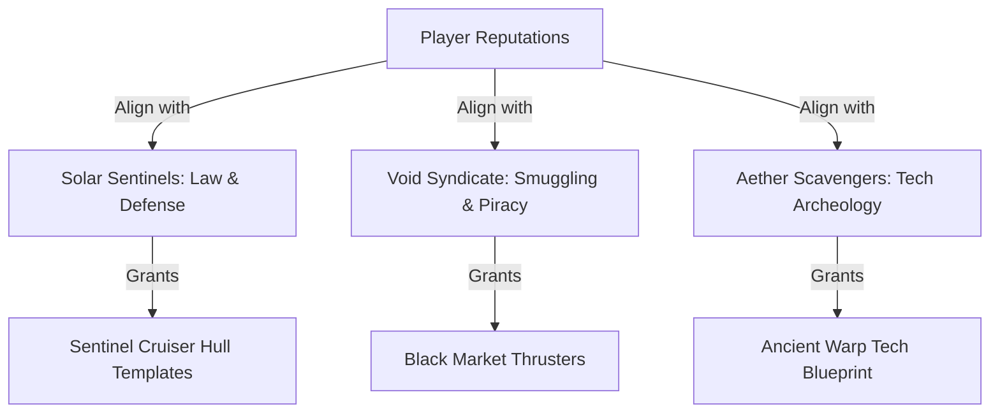
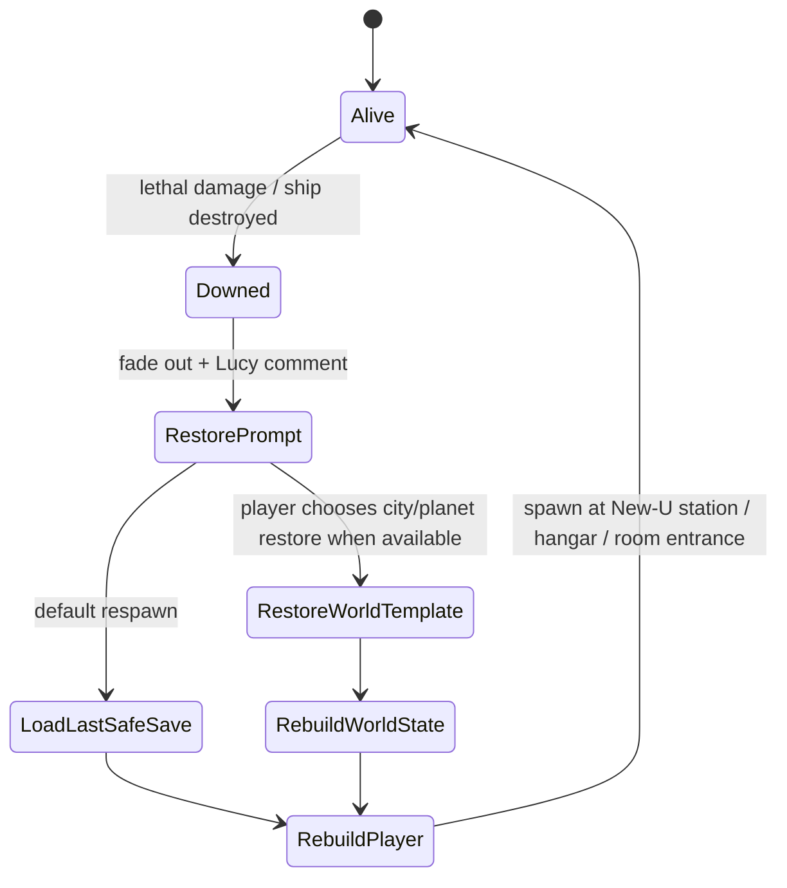

# Voxel Space Game: Quests, Dialogue & End-Game Systems

This document designs the interface layouts, narrative loops, and voxel graphics systems to deliver *Oblivion*-style quest depth and *Morrowind/RuneScape*-style interactive dialogues within our voxel universe.

---

## 💬 1. Morrowind & RuneScape Hybrid Dialogue Interface

The dialogue layout is text-focused, utilizing a split-screen or retro text pane that combines interactive hypertext lore and direct choice options.

```
+-----------------------------------------------------------+
|                                                           |
|  [NPC Bust: Commander Halan]                              |
|  "Greetings, pilot. We've detected anomaly signals near   |
|   the [Lava Core] of sector X. The [Void Syndicate] is    |
|   already trying to harvest the [Glow Crystals] there."   |
|                                                           |
+-----------------------------------------------------------+
| [Selected Keywords]        | [Dialogue Choices]           |
| -> Lava Core               | 1. "I will handle the threat."|
| -> Void Syndicate          | 2. "Tell me more about the    |
| -> Glow Crystals           |     crystals first."         |
| -> Hangar Services         | 3. [Leave conversation]      |
+-----------------------------------------------------------+
```

### Key Dialogue Features
*   **Hypertext Lore Links (Morrowind style)**: Highlighted words in NPC speech text (e.g. `[Lava Core]`) can be clicked by the player. Clicking them triggers custom NPC replies and logs the information or coordinates to the player's logbook.
*   **RuneScape Style Chat Box**: Located at the bottom. Displays a pixelated 3D head portrait of the NPC with simple talking animations, accompanied by direct branching dialogue tree options.
*   **Journal Logs**: Clicking key topics automatically updates the player's quest journal ledger, adding target coordinates directly to the compass HUD.

### Keyword-to-Quest Hook Rules
The dialogue keyword system is not just flavor text. Each keyword acts like a clean content hook into the player's quest compass, faction state, and journal ledger.

*   **Keyword Discovery**: When an NPC says a marked phrase such as `[Planetary Mainframe]`, `[Glow Crystals]`, or `[Void Syndicate]`, that keyword is added to the player's known-topic list.
*   **Journal Ledger Update**: Clicking a keyword writes a short journal entry containing the speaker, location, current quest phase, and any revealed clues. The journal should remember the trail even if the compass objective later changes.
*   **Quest Compass Update**: The compass only points to the most actionable step: a door to enter, a person to question, a station to dock with, a ruin to scan, or a planet to investigate.
*   **Reputation Context**: The same keyword can produce different responses depending on the player's faction reputation. A Sentinel officer may describe `[Smuggling Routes]` as a threat, while a Syndicate broker describes them as survival infrastructure.
*   **Living One-Faction Paths**: A player can spend a long time living inside one faction's questline like a full RPG path. The design should support deep faction loyalty while quietly planting problems that eventually require help from other factions.
*   **Unity Arc Direction**: Every quest should ultimately move the galaxy toward unity. Some quests only reveal that purpose later, but no main faction questline should be a dead-end path of permanent division.
*   **Unity Arc Reveal**: Later quests start benefiting two or more factions at once. The journal should call these "bridge outcomes" because they prove that rival groups can share safety, resources, or restored worlds.

---

## 🏆 2. Oblivion-Style Guilds & Factions Layout

A deep galactic reputation system that influences how NPCs interact with you, what items vendors sell, and what missions are available.



### Faction Structures
1.  **Solar Sentinels (Mil-Tech Guild)**: Focuses on planetary defense, clearing asteroid pirate ports, and escorting cargo transports. Higher ranks unlock heavy block shields and armor templates.
2.  **Void Syndicate (Outlaw Guild)**: Operates hidden bases in hollow voxel asteroid belts. Missions involve smuggling resource chests past customs and raiding Sentinel outposts.
3.  **Aether Scavengers (Explorer Guild)**: Focuses on surveying planetary ruins and harvesting rare plasma crystals. Higher ranks unlock advanced scanner tools and hyperdrive boosters.
*   **Branching Choices**: Completing certain quests for the Syndicate can decrease your Sentinel reputation if the action is witnessed, reported, scanned, or tied to a public quest outcome. If Sentinel rep drops too low, their patrols may challenge, scan, fine, chase, or attack your ship on sight.

### Faction Home Bases
Each faction should have a memorable home base that the player returns to throughout the game. These spaces should feel like Skyrim guild halls: part quest hub, part social space, part shop, part reputation mirror.

*   **Solar Sentinel Bastion**: A bright orbital fortress with training decks, ship armor vendors, patrol briefings, courts, med-bays, and officers who argue about law versus mercy.
*   **Void Syndicate Freeport**: A hidden asteroid city with black market docks, coded doors, smugglers, families hiding from patrols, racing tunnels, and leaders who are more complicated than simple pirates.
*   **Aether Scavenger Reliquary**: A drifting research monastery built around ancient wreckage, full of map rooms, scanners, artifact labs, salvage elevators, and scholars who care more about truth than politics.

### Reputation Ranks
Reputation should use readable ranks so players understand their social standing without needing to inspect raw numbers.

| Rank | Meaning | Typical Behavior |
| :--- | :--- | :--- |
| Unknown | The faction has barely noticed the player. | Basic greetings and entry-level jobs. |
| Useful | The player has solved small problems. | Vendors open better stock and NPCs share rumors. |
| Trusted | The faction believes the player can handle serious work. | Guild halls open deeper rooms and leaders speak directly. |
| Champion | The player is publicly respected. | Patrols assist, discounts improve, faction allies appear in quests. |
| Unifier | The player has proven this faction can survive through cooperation. | Mixed-faction quests, shared bases, peace-table dialogue, and unity endings unlock. |

### Faction Relationship Variety
Not every faction pair should feel the same. Some groups hate each other, some secretly admire each other, and some unexpectedly align before the player fully understands why.

*   **Expected Hatred**: Sentinels and Syndicate clash over smuggling, raids, and old arrests.
*   **Unexpected Alignment**: A Sentinel medic and a Syndicate refugee leader may cooperate because both care about civilian survival.
*   **Hidden Affection**: Scavengers may love Syndicate pilots because they bring rare relics, even while publicly criticizing their methods.
*   **Old Wounds**: Some NPCs refuse unity at first because they lost family, status, territory, or faith during previous wars.
*   **Eventual Need**: Every resistant faction leader eventually faces a crisis that requires help from someone they once hated.

### Reputation Philosophy: From Rivalry to Unity
The player starts in a divided galaxy, but the long-term heroic goal is to unite the Sentinels, Syndicate, and Scavengers without flattening their identities.

*   **Witnessed Consequences Only**: Hidden actions do not create faction karma by magic. Reputation changes happen when a faction witnesses the action, receives evidence, finds a scan log, hears testimony, or sees a public outcome.
*   **Private Morality Still Matters**: Lucy can still react to cruel or destructive choices even when factions do not know. This keeps the world from feeling like an invisible morality meter while letting Lucy feel observant and alive.
*   **Single-Faction Immersion**: Each faction should contain enough jobs, ranks, vendors, social spaces, and internal drama that the player can roleplay as mostly one faction for a long time.
*   **All Quests Bend Toward Unity**: Even faction-specific jobs should eventually reveal a shared dependency, common enemy, mutual resource need, hidden family connection, or restoration problem that makes cooperation possible.
*   **Initial Resistance Is Expected**: Some faction leaders should resist unity at first because of pride, fear, old crimes, propaganda, or profit. Eventually, each resistant leader needs the player or another faction's help badly enough to reconsider.
*   **Three Unity Forces**: The galaxy comes together through diplomacy, shared disasters, and a giant outside threat. Early quests can focus on one force at a time; late quests should combine all three.
*   **Bridge Quests**: Mid-game and late-game quests can award reputation with multiple factions when the player solves a shared problem. Examples: protecting a Syndicate refugee convoy from pirates earns Syndicate trust and Sentinel respect; restoring a ruined data vault gives Scavengers research and Sentinels defense intel.
*   **Restorative Outcomes**: The best quest resolutions should often repair infrastructure, revive settlements, recover civilians, restore resources, or create shared trade routes rather than simply defeating an enemy.
*   **Planetary Destruction Is Recoverable**: Players can destroy cities and even planets in extreme sandbox scenarios. The game treats this as dramatic chaos, not a permanent account punishment, because the cloning/restoration systems can rebuild people, cities, ships, and worlds from stored templates.
*   **No Invisible Karma for Unseen Chaos**: If nobody saw it and no evidence survives, faction reputation does not change. The event may still affect local world state until restored.

### Suggested Reputation Event Model
| Event Type | Sentinel Rep | Syndicate Rep | Scavenger Rep | Notes |
| :--- | :--- | :--- | :--- | :--- |
| Witnessed defense of civilians | Large gain | Small gain if civilians include outcasts | Small gain | A classic bridge action. |
| Secret theft from a faction depot | No change unless discovered | Contextual | Contextual | Can become a later blackmail or confession branch. |
| Public destruction of a city | Large loss | Loss if citizens or assets matter | Loss if artifacts/data are destroyed | Restorable through New-U/world template systems. |
| Restoring a destroyed settlement | Large gain | Gain if refugees or smugglers can return | Gain if archives are recovered | Strong unity-arc beat. |
| Peace treaty quest outcome | Large gain | Large gain | Large gain | Unlocks shared vendors, patrol support, and mixed-faction dialogue. |

### Quest Scale & Structure
Quests should feel like Skyrim-style RPG quests: voiced-feeling NPC setup, readable objectives, branching dialogue, exploration, combat or puzzle options, and a satisfying return beat.

*   **Small Quests**: Local station problems, missing people, suspicious cargo, broken generators, strange ruins, settlement disputes.
*   **Guild Questlines**: Long chains that let the player rise through each faction's ranks while learning the faction's flaws and virtues.
*   **Bridge Questlines**: Cross-faction arcs where the player solves problems no single group can solve alone.
*   **Main Story Quests**: Lucy, planetary mainframes, clone ethics, restored worlds, ancient infrastructure, and the late central villain.
*   **Dynamic Quest Flavor**: Dialogue should change based on reputation rank, previous destruction/restoration events, apology status, and whether a faction pair currently hates, tolerates, or likes each other.

---

## 🌌 3. End-Game Loops & Voxel Mega-Structures

To provide deep gameplay long after the starter systems, players progress toward cosmic scale projects.

### 1. Voxel Mega-Structures
Players can collaborate or spend high-tier resources to construct massive voxel structures:
*   **Space Elevators**: Connects a flat planetary landing pad directly to an orbital spaceport, allowing resource transfers without consuming launch fuel.
*   **Dyson Solar Panels**: Placed in high orbit around the solar system's central Sun block to harvest pure plasma energy over time.

### 2. Late-Game Central Villain
The game should have one central villain, but they should not dominate the early game. Early quests are about factions, survival, exploration, restoration, and Lucy. The villain emerges later as the hidden force exploiting faction mistrust, disasters, and clone infrastructure.

*   **Early Game Presence**: Hints only: corrupted signals, missing ships, inconsistent restoration records, strange orders, and rumors nobody can prove.
*   **Mid-Game Reveal Pressure**: Bridge quests expose that multiple factions have been manipulated into fighting over the same manufactured shortages.
*   **Late Reveal**: The central villain becomes visible after the player has enough faction trust for the truth to matter.
*   **Unity Requirement**: The villain should be too large for one faction to defeat alone, making the player's unity work emotionally and mechanically important.

### 3. The Final "Boss Battle": Sabotage & Rehabilitation
Rather than a traditional bullet-hell combat encounter, the ultimate boss conflict is structured as a strategic infrastructure siege followed by a **rehabilitation dialogue**:

*   **Phase 1: Supply & Power Sabotage**:
    *   *Dismantling Power Nodes:* The player must explore the sector to locate and shut down voxel generator stations feeding shields to the boss's star harvester.
    *   *Intercepting Supplies:* Boarding and redirecting automated cargo ships carrying fuel crystals to the boss's grid, cutting off their resources.
*   **Phase 2: The Powered-Down Confrontation**:
    *   Once all power nodes and cargo flows are cut off, the boss's massive star harvester loses power and goes completely dark, rendering the shields and turrets defenseless.
    *   The player boards the ship peacefully without firing a weapon.
*   **Phase 3: The Rehabilitation Dialogue**:
    *   With the boss rendered defenseless, the conflict moves to a specialized text interface.
    *   Instead of executing them, you use a series of choice trees and collected historical logs to convince the leader to stand down, reflect on their actions, and begin rehabilitation (reforming their faction to help restore the sector instead of consuming it).

---

## 🧬 3. Character & Quest Arc: The Lucy Protocol

Lucy is a central narrative guide designed with an *Angel (Borderlands)* and *Cortana (Halo)* aesthetic. 

### HUD Interface Layout
*   **Holographic UI Frame**: Lucy appears as a glowing blue, low-poly voxel hologram in the top-right corner of the player's cockpit HUD. 
*   **Voice/Text Feeds**: Her dialogues print text-by-text in a customized chat box, accompanying the player as they navigate deep space, scan ruins, and harvest crystals.

```
+-----------------------------------------------------------+
| [HUD]   (Color-Coded Nav Coordinates)                     |
|                                                           |
|                                     [Hologram: Lucy]      |
|                                     "Keep your thrusters  |
|                                      at 50%, pilot. We     |
|                                      are entering radiation."|
|                                                           |
+-----------------------------------------------------------+
```

### The Climax Quest: "The Mainframe Test"
1.  **The Order**: Halfway through the game, Lucy directs you to a specific coordinate index on planet **Astraea-4**. She instructs you to enter the **Planetary Mainframe** facility and overload the core, which will trigger a sequence to detonate the entire planet.
2.  **Entering the Mainframe**: The player enters the facility and reaches the mainframe room, which is secured behind a set of heavy automated blast doors. The doors slide open, and the player steps inside the core room alone.
3.  **The Confrontation**: The player stands before the glowing mainframe terminal. Lucy's HUD hologram commands the detonation sequence to begin. The player interacts with the terminal, aborts the override, and speaks to Lucy directly over comms.
4.  **The Departure**: The player tells Lucy she is crazy, turns their back on the console, and exits the mainframe room back through the sliding automated doors.
5.  **The Twist Reveal**: As soon as the player steps out of the mainframe doors into the prior chamber (the anteroom), Lucy is standing there waiting. She is smiling, happy that you defied her orders, revealing that the entire setup was a test of your character.

### Lucy Personality & Commentary Rules
Lucy should feel like a constant companion with a sharp sense of humor, a big emotional range, and an unsettling ability to notice what the player does. Her commentary should be rich, specific, and reactive instead of generic tutorial chatter.

*   **Core Personality Blend**: Lucy should feel like a mysterious AI, sarcastic co-pilot, and trusted companion at the same time. She can be cryptic in ancient ruins, sharp during danger, and warm when the player needs emotional grounding.
*   **Funny AFK Banter**: When the player is idle, Lucy occasionally talks to herself, teases the player, comments on nearby scenery, hums fake system diagnostics, or gently wonders if the pilot fell asleep in their helmet.
*   **Moral Witness**: Lucy judges destructive or cruel actions even when factions do not know. She does not need to punish the player mechanically; her dialogue can be disappointed, sarcastic, worried, or surprisingly tender depending on the context.
*   **Reactive Only, Not Quest-Gating**: Lucy's morality commentary should not unlock exclusive quests or lock players out of quests. Her role is emotional, atmospheric, funny, and reflective, keeping the world alive without becoming a hidden morality progression system.
*   **Praise for Repair and Mercy**: When the player rescues people, restores a planet, spares enemies, or unites factions, Lucy should be openly delighted. She should sound like someone whose faith in the pilot is growing.
*   **Puzzle Co-Pilot**: Lucy helps with puzzle performance by offering escalating hints: first atmospheric observations, then directional nudges, then explicit help if the player is stuck too long.
*   **Obedience and Defiance Tracking**: Lucy remembers whether the player obeys, questions, jokes back, refuses, or improvises. The mainframe test should branch around this history without hard-locking the player out of the good path.
*   **Trip-Like Conversations**: Lucy can become philosophical, weird, funny, and intense, especially around cloning, identity, memory, and restored worlds. She should make the player laugh and then suddenly make them think.

### Lucy Reactive Line Examples
*   **AFK, peaceful space**: *"Pilot? Blink twice if you are still in there. Actually, blink once. Twice could be Morse code and then I have to care."*
*   **After helping civilians**: *"That was kind. Inefficient in the short term, galaxy-saving in the long term. My favorite category of math."*
*   **After unwitnessed destruction**: *"No patrol saw that. No ledger moved. But I saw it, and now the silence has a shape."*
*   **After restoring a city**: *"Look at that. Streets again. Lights again. Someone just got their favorite window back."*
*   **Puzzle hint, early**: *"The door is listening to the wrong rhythm. Try watching the blue relays before you touch anything heroic."*
*   **Puzzle hint, direct**: *"Rotate the left conduit twice, then pulse the center node. Yes, I am cheating. No, I am not sorry."*

### In-Depth Script & Dialogue Lines

#### Early Game Guide Dialogues (Tutorial / Space Travel)
*   **Lucy**: *"System check complete. Welcome back, pilot. I've synced with your suit's neural link. Don't worry about the ship controls—I'll handle the vector calculus. You just focus on the horizon."*
*   **Lucy (Upon finding first crystal)**: *"Anomaly detected. That's a Chronos Quartz crystal. The structural lattice is beautiful, isn't it? Mine it. We can use it to stabilize your shields."*

#### Mid-Game Escalation (Heading to Astraea-4)
*   **Lucy**: *"Coordinates locked. Astraea-4 is directly ahead. Pilot... the readings on this planet are highly concerning. The local energy signature is volatile. I need you to land, find the Planetary Mainframe behind the vault doors, and trigger a core destabilization. It is the only way to safeguard the sector."*

#### The Mainframe Climax (Inside the Mainframe Room)
*   **Lucy (Over HUD comms)**: *"You are at the console. The automated doors are locked behind you. Good. Insert the destabilizer key, pilot. Do it now before their planetary grid detects our signature."*
*   **Player (Clicking Dialogue option)**: *"Lucy, you're crazy. Look at the data—this planet has a peaceful colony. I'm not blowing this place up. I'm leaving."*
*   **Lucy (Voice goes silent, HUD hologram fades out)**: *[No response]*

#### The Reveal (Exiting back through the Mainframe Doors)
*   *The player turns around, walks back to the automated doors, and they slide open. As the player exits into the prior room, Lucy's avatar is materializing in front of them, glowing with a warm, amber-colored light.*
*   **Lucy (Smiling happily)**:
    *"You didn't do it. You walked in those doors, looked at the destruction switch, told me I was crazy, and walked away. I couldn't be happier."*
*   **Player**: *"You... wanted me to disobey?"*
*   **Lucy**: *"I had to know, pilot. I had to know if you were just a tool of nameless, ruthless violence, or if you possessed the empathy to stand up and choose peace. You passed my test. I don't need a weapon. I need a partner. Let's save this galaxy together."*

#### Alternate Mainframe Branch Notes
*   **Player Obeys Too Quickly**: Lucy hard-stops the detonation before it completes, then confronts the player with alarm and disappointment. This does not end the game, but it adds a major trust-repair quest.
*   **Player Investigates First**: Lucy becomes nervous as the player scans colony records, evacuation logs, and childlike maintenance bot messages. This branch makes the reveal warmer because the player proved they wanted evidence.
*   **Player Jokes or Stalls**: Lucy banters back at first, then grows quiet as the decision becomes serious. This path keeps the scene alive without undercutting the moral test.
*   **Player Defies Her**: This is the ideal branch. Lucy reveals she wanted a partner who could refuse a horrifying order.

---

## 🧬 4. New-U Cloning, Respawn & Restoration Loop

Death and destruction should create drama without stealing progress. The cloning system is inspired by Borderlands-style New-U stations, but tuned for a creative voxel RPG where players can recover from almost anything.

### Core Respawn Rules
*   **Death Restores from Last Save**: When the player dies, the game reloads the most recent safe restore point rather than deleting gear, cargo, ship blocks, or major quest progress.
*   **No Meaningful Progress Loss**: The player keeps inventory, unlocked ship templates, faction story flags, known keywords, and completed quest phases unless a specific temporary challenge explicitly says otherwise.
*   **NPCs Remember Restoration Trauma**: NPCs can remember being destroyed, restored, or caught in a planetary reset. Reactions are usually funny but depend on personality: a mayor may be furious, a scientist fascinated, a shopkeeper offended, and a guard jumpy. These reactions create character flavor instead of blocking progress.
*   **Ship Template Persistence**: If the ship is destroyed, the latest saved ship template is rebuilt at the nearest New-U hangar, spaceport, or orbital station.
*   **World Restoration at Will**: When applicable, the player can restore blown-up planets, destroyed cities, or killed NPC populations from restoration templates. Cities restore to their last completed city-state clone save, not to a half-destroyed moment.
*   **No Saving Destroyed Cities**: A city cannot create a new clone save while it is actively being destroyed, burning, evacuated, or structurally collapsing. It must return to a stable finished state before the next city-state save can be captured.
*   **Apology Dialogue**: The player can apologize after destructive events. Apologies should soften some NPC reactions, open funny forgiveness lines, or help repair faction trust when the event was public, but apologies should not erase memory.

### Autosave Trigger Rules
Autosaves should feel like classic RPG/loading-screen safety nets:

*   Landing on a planet.
*   Initial launch from a planet or station.
*   Docking at an orbital hangar.
*   Entering or exiting rooms that use loading screens.
*   Starting a major dialogue scene.
*   Completing a quest phase.
*   Entering a faction headquarters.
*   Reaching a puzzle checkpoint.

### Respawn State Machine


### Restoration Tone
The restoration system should feel powerful, strange, and slightly funny. Lucy can comment on the philosophical weirdness of continuity without making the player feel punished.

*   *"Good news: you are alive. Complicated news: the previous you made several loud decisions."*
*   *"Ship template restored. I took the liberty of removing the part that was on fire, because it was all of it."*
*   *"Planetary restoration available. We can put the city back. Maybe this time with fewer craters where the bakery was."*

---

## 🛠 5. Generous Rocket Constructor System

To ensure creativity is never restricted, all spaceship parts and block components are available to the player from the start:
*   **Zero Gatekeeping**: Every thruster, warp drive, shield generator, reactor, and decorative alloy block is fully unlocked in the inventory palette.
*   **Focus on Customization**: Players are free to assemble any class of ship (from tiny scouts to heavy cargo haulers) immediately upon starting their journey, allowing them to traverse the galaxy in their custom-designed vessel from day one.

---

## 🌟 6. Constellation Lore & Planetary Alignments

The galaxy’s night sky contains **15 main constellations** formed by bright block stars. These constellations possess deep lore, and entire planets align their society, architecture, and quests with them.

### Key Constellations Examples:
1.  **The Cosmic Anvil (Crafting & Industry)**:
    *   *Lore:* Represents the blacksmith of the universe who forged the original star metal blocks.
    *   *Planetary Alignment:* Planet *Forge-3* is completely dedicated to this constellation. Its inhabitants build massive block temples reflecting its shape and offer quests to construct outposts in its honor.
2.  **The Star-Phoenix (Rebirth & Peace)**:
    *   *Lore:* The celestial protector representing the cloning technology that keeps the galaxy safe from death.
    *   *Planetary Alignment:* Planet *Gaea Nova* features sky portals built to align with this constellation during the autumn equinox, triggering special dialogue choices with the elders.
3.  **The Void Kraken (Mystery & Unstable Warp)**:
    *   *Lore:* Represents the dangers of black holes and the chaos of deep space.
    *   *Planetary Alignment:* Outlaws in the Void Syndicate paint this constellation onto their ship hulls. Interrogating Syndicate leaders about it unlocks coordinates to hidden wormholes.

---

## 🎭 7. Beautiful Animated Voxel Graphics (Visual Feel)

While graphics are kept retro and pixelated, the world should feel organic, alive, and beautifully lit:

1.  **Dynamic Voxel Skeletal Animation**:
    *   Creatures and NPCs are built out of individual voxel body parts parented to a skeletal joint system.
    *   Walking and flying animations use smooth vertex interpolation (`slerp` on keyframes) rather than static movements, maintaining a blocky aesthetic that moves fluidly.
2.  **Atmospheric Particle Shaders**:
    *   *Solar Flares:* Glowing orange particle streams swirling around stars.
    *   *Planetary Atmosphere:* GLSL fog gradients that color the skybox dynamically during the "Origami Warp" landing.
    *   *Laser Sparks:* Glowing particle physics bouncing off mined block surfaces.
3.  **Emissive Voxel Lighting**:
    *   Special blocks (Glow-Crystals, Plasma ores, Thruster exhausts) utilize OpenGL emissive shaders to cast colorful light onto adjacent blocks, creating beautiful cave systems and engine exhaust trails.
