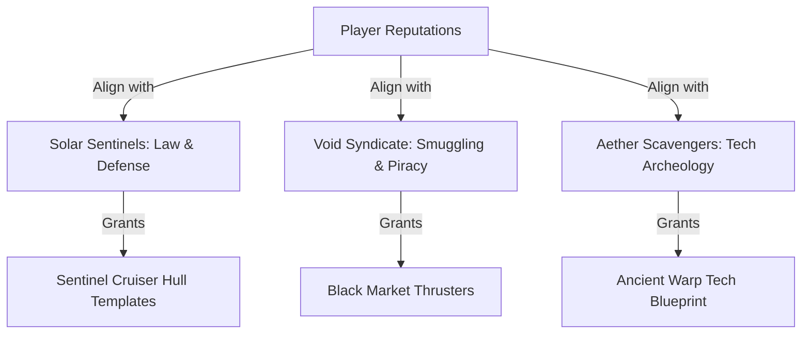

# Voxel Space Game: Quests, Dialogue & End-Game Systems

This document designs the interface layouts, narrative loops, and voxel graphics systems to deliver *Oblivion*-style quest depth and *Morrowind/RuneScape*-style interactive dialogues within our voxel universe.

---

## 💬 1. Morrowind & RuneScape Hybrid Dialogue Interface

The dialogue layout is text-focused, utilizing a split-screen or retro text pane that combines interactive hypertext lore and direct choice options.

```
+-----------------------------------------------------------+
|                                                           |
|  [NPC Bust: Commander Halan]                              |
|  "Greetings, pilot. We've detected anomaly signals near   |
|   the [Lava Core] of sector X. The [Void Syndicate] is    |
|   already trying to harvest the [Glow Crystals] there."   |
|                                                           |
+-----------------------------------------------------------+
| [Selected Keywords]        | [Dialogue Choices]           |
| -> Lava Core               | 1. "I will handle the threat."|
| -> Void Syndicate          | 2. "Tell me more about the    |
| -> Glow Crystals           |     crystals first."         |
| -> Hangar Services         | 3. [Leave conversation]      |
+-----------------------------------------------------------+
```

### Key Dialogue Features
*   **Hypertext Lore Links (Morrowind style)**: Highlighted words in NPC speech text (e.g. `[Lava Core]`) can be clicked by the player. Clicking them triggers custom NPC replies and logs the information or coordinates to the player's logbook.
*   **RuneScape Style Chat Box**: Located at the bottom. Displays a pixelated 3D head portrait of the NPC with simple talking animations, accompanied by direct branching dialogue tree options.
*   **Journal Logs**: Clicking key topics automatically updates the player's quest journal ledger, adding target coordinates directly to the compass HUD.

---

## 🏆 2. Oblivion-Style Guilds & Factions Layout

A deep galactic reputation system that influences how NPCs interact with you, what items vendors sell, and what missions are available.



### Faction Structures
1.  **Solar Sentinels (Mil-Tech Guild)**: Focuses on planetary defense, clearing asteroid pirate ports, and escorting cargo transports. Higher ranks unlock heavy block shields and armor templates.
2.  **Void Syndicate (Outlaw Guild)**: Operates hidden bases in hollow voxel asteroid belts. Missions involve smuggling resource chests past customs and raiding Sentinel outposts.
3.  **Aether Scavengers (Explorer Guild)**: Focuses on surveying planetary ruins and harvesting rare plasma crystals. Higher ranks unlock advanced scanner tools and hyperdrive boosters.
*   **Branching Choices**: Completing certain quests for the Syndicate will decrease your Sentinel reputation. If Sentinel rep drops too low, their patrols will attack your ship on sight.

---

## 🌌 3. End-Game Loops & Voxel Mega-Structures

To provide deep gameplay long after the starter systems, players progress toward cosmic scale projects.

### 1. Voxel Mega-Structures
Players can collaborate or spend high-tier resources to construct massive voxel structures:
*   **Space Elevators**: Connects a flat planetary landing pad directly to an orbital spaceport, allowing resource transfers without consuming launch fuel.
*   **Dyson Solar Panels**: Placed in high orbit around the solar system's central Sun block to harvest pure plasma energy over time.

### 2. The Final "Boss Battle": Sabotage & Rehabilitation
Rather than a traditional bullet-hell combat encounter, the ultimate boss conflict is structured as a strategic infrastructure siege followed by a **rehabilitation dialogue**:

*   **Phase 1: Supply & Power Sabotage**:
    *   *Dismantling Power Nodes:* The player must explore the sector to locate and shut down voxel generator stations feeding shields to the boss's star harvester.
    *   *Intercepting Supplies:* Boarding and redirecting automated cargo ships carrying fuel crystals to the boss's grid, cutting off their resources.
*   **Phase 2: The Powered-Down Confrontation**:
    *   Once all power nodes and cargo flows are cut off, the boss's massive star harvester loses power and goes completely dark, rendering the shields and turrets defenseless.
    *   The player boards the ship peacefully without firing a weapon.
*   **Phase 3: The Rehabilitation Dialogue**:
    *   With the boss rendered defenseless, the conflict moves to a specialized text interface.
    *   Instead of executing them, you use a series of choice trees and collected historical logs to convince the leader to stand down, reflect on their actions, and begin rehabilitation (reforming their faction to help restore the sector instead of consuming it).

---

## 🧬 3. Character & Quest Arc: The Lucy Protocol

Lucy is a central narrative guide designed with an *Angel (Borderlands)* and *Cortana (Halo)* aesthetic. 

### HUD Interface Layout
*   **Holographic UI Frame**: Lucy appears as a glowing blue, low-poly voxel hologram in the top-right corner of the player's cockpit HUD. 
*   **Voice/Text Feeds**: Her dialogues print text-by-text in a customized chat box, accompanying the player as they navigate deep space, scan ruins, and harvest crystals.

```
+-----------------------------------------------------------+
| [HUD]   (Color-Coded Nav Coordinates)                     |
|                                                           |
|                                     [Hologram: Lucy]      |
|                                     "Keep your thrusters  |
|                                      at 50%, pilot. We     |
|                                      are entering radiation."|
|                                                           |
+-----------------------------------------------------------+
```

### The Climax Quest: "The Mainframe Test"
1.  **The Order**: Halfway through the game, Lucy directs you to a specific coordinate index on planet **Astraea-4**. She instructs you to enter the **Planetary Mainframe** facility and overload the core, which will trigger a sequence to detonate the entire planet.
2.  **Entering the Mainframe**: The player enters the facility and reaches the mainframe room, which is secured behind a set of heavy automated blast doors. The doors slide open, and the player steps inside the core room alone.
3.  **The Confrontation**: The player stands before the glowing mainframe terminal. Lucy's HUD hologram commands the detonation sequence to begin. The player interacts with the terminal, aborts the override, and speaks to Lucy directly over comms.
4.  **The Departure**: The player tells Lucy she is crazy, turns their back on the console, and exits the mainframe room back through the sliding automated doors.
5.  **The Twist Reveal**: As soon as the player steps out of the mainframe doors into the prior chamber (the anteroom), Lucy is standing there waiting. She is smiling, happy that you defied her orders, revealing that the entire setup was a test of your character.

### In-Depth Script & Dialogue Lines

#### Early Game Guide Dialogues (Tutorial / Space Travel)
*   **Lucy**: *"System check complete. Welcome back, pilot. I've synced with your suit's neural link. Don't worry about the ship controls—I'll handle the vector calculus. You just focus on the horizon."*
*   **Lucy (Upon finding first crystal)**: *"Anomaly detected. That's a Chronos Quartz crystal. The structural lattice is beautiful, isn't it? Mine it. We can use it to stabilize your shields."*

#### Mid-Game Escalation (Heading to Astraea-4)
*   **Lucy**: *"Coordinates locked. Astraea-4 is directly ahead. Pilot... the readings on this planet are highly concerning. The local energy signature is volatile. I need you to land, find the Planetary Mainframe behind the vault doors, and trigger a core destabilization. It is the only way to safeguard the sector."*

#### The Mainframe Climax (Inside the Mainframe Room)
*   **Lucy (Over HUD comms)**: *"You are at the console. The automated doors are locked behind you. Good. Insert the destabilizer key, pilot. Do it now before their planetary grid detects our signature."*
*   **Player (Clicking Dialogue option)**: *"Lucy, you're crazy. Look at the data—this planet has a peaceful colony. I'm not blowing this place up. I'm leaving."*
*   **Lucy (Voice goes silent, HUD hologram fades out)**: *[No response]*

#### The Reveal (Exiting back through the Mainframe Doors)
*   *The player turns around, walks back to the automated doors, and they slide open. As the player exits into the prior room, Lucy's avatar is materializing in front of them, glowing with a warm, amber-colored light.*
*   **Lucy (Smiling happily)**:
    *"You didn't do it. You walked in those doors, looked at the destruction switch, told me I was crazy, and walked away. I couldn't be happier."*
*   **Player**: *"You... wanted me to disobey?"*
*   **Lucy**: *"I had to know, pilot. I had to know if you were just a tool of nameless, ruthless violence, or if you possessed the empathy to stand up and choose peace. You passed my test. I don't need a weapon. I need a partner. Let's save this galaxy together."*

---

## 🛠 5. Generous Rocket Constructor System

To ensure creativity is never restricted, all spaceship parts and block components are available to the player from the start:
*   **Zero Gatekeeping**: Every thruster, warp drive, shield generator, reactor, and decorative alloy block is fully unlocked in the inventory palette.
*   **Focus on Customization**: Players are free to assemble any class of ship (from tiny scouts to heavy cargo haulers) immediately upon starting their journey, allowing them to traverse the galaxy in their custom-designed vessel from day one.

---

## 🌟 6. Constellation Lore & Planetary Alignments

The galaxy’s night sky contains **15 main constellations** formed by bright block stars. These constellations possess deep lore, and entire planets align their society, architecture, and quests with them.

### Key Constellations Examples:
1.  **The Cosmic Anvil (Crafting & Industry)**:
    *   *Lore:* Represents the blacksmith of the universe who forged the original star metal blocks.
    *   *Planetary Alignment:* Planet *Forge-3* is completely dedicated to this constellation. Its inhabitants build massive block temples reflecting its shape and offer quests to construct outposts in its honor.
2.  **The Star-Phoenix (Rebirth & Peace)**:
    *   *Lore:* The celestial protector representing the cloning technology that keeps the galaxy safe from death.
    *   *Planetary Alignment:* Planet *Gaea Nova* features sky portals built to align with this constellation during the autumn equinox, triggering special dialogue choices with the elders.
3.  **The Void Kraken (Mystery & Unstable Warp)**:
    *   *Lore:* Represents the dangers of black holes and the chaos of deep space.
    *   *Planetary Alignment:* Outlaws in the Void Syndicate paint this constellation onto their ship hulls. Interrogating Syndicate leaders about it unlocks coordinates to hidden wormholes.

---

## 🎭 7. Beautiful Animated Voxel Graphics (Visual Feel)

While graphics are kept retro and pixelated, the world should feel organic, alive, and beautifully lit:

1.  **Dynamic Voxel Skeletal Animation**:
    *   Creatures and NPCs are built out of individual voxel body parts parented to a skeletal joint system.
    *   Walking and flying animations use smooth vertex interpolation (`slerp` on keyframes) rather than static movements, maintaining a blocky aesthetic that moves fluidly.
2.  **Atmospheric Particle Shaders**:
    *   *Solar Flares:* Glowing orange particle streams swirling around stars.
    *   *Planetary Atmosphere:* GLSL fog gradients that color the skybox dynamically during the "Origami Warp" landing.
    *   *Laser Sparks:* Glowing particle physics bouncing off mined block surfaces.
3.  **Emissive Voxel Lighting**:
    *   Special blocks (Glow-Crystals, Plasma ores, Thruster exhausts) utilize OpenGL emissive shaders to cast colorful light onto adjacent blocks, creating beautiful cave systems and engine exhaust trails.
